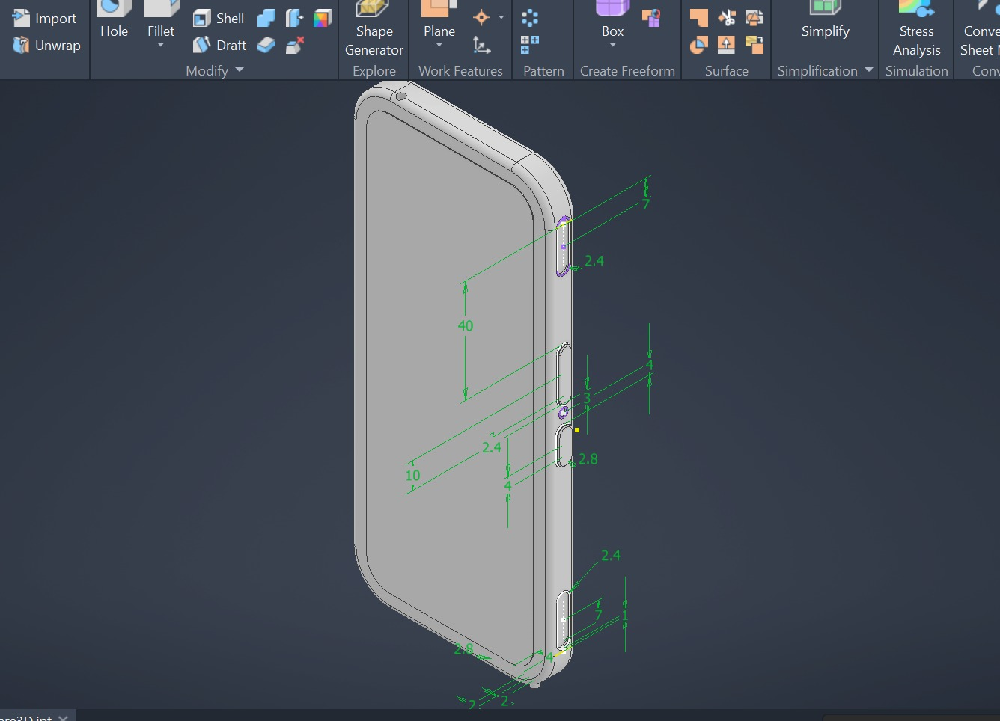
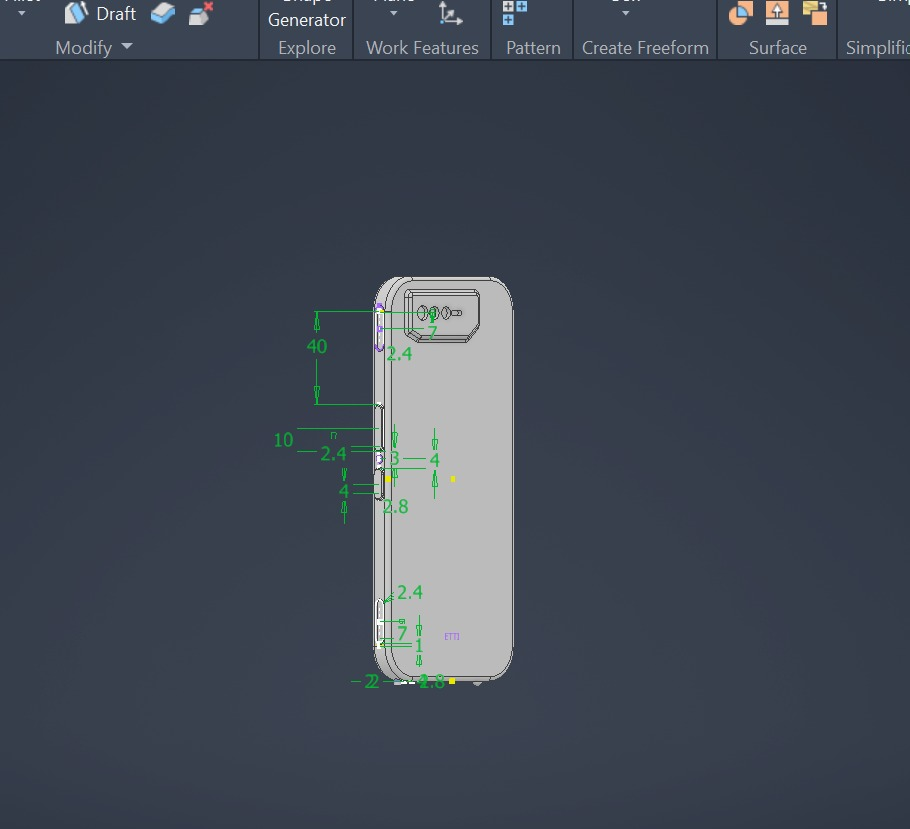
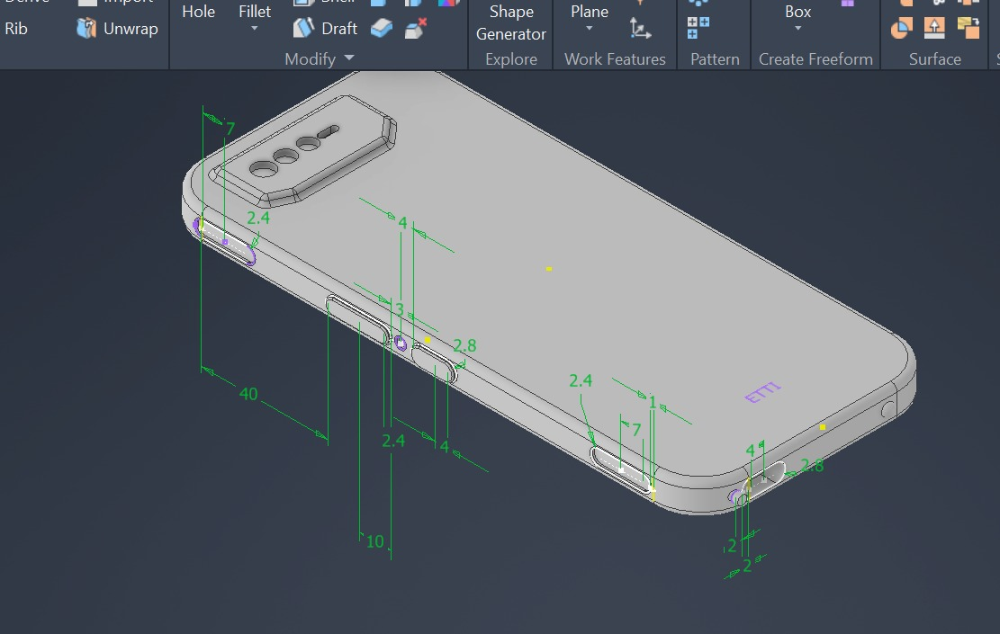

# Phone-Case-Inventor

A 3D model of a phone case for the **Asus ROG Phone 6**, designed in Autodesk Inventor.

## Contents
- `PhoneCase.ipt` – the Inventor part file
- `/images` – renders/photos of the final result

## Details
- Designed in Autodesk Inventor [version, e.g. 2024]
- Includes cutouts for the camera, buttons, charging ports, and speakers
- Suitable for 3D printing (tested with [material, e.g. TPU/PLA])

## How to use
1. Open the `.ipt` file in Autodesk Inventor ([version] or newer).
2. To 3D print it, export it as `.stl` (File → Export → CAD Format) and slice it with your preferred slicer.
